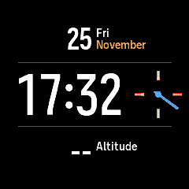
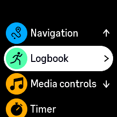

# suunto-emu

A standalone, deterministic C99 emulator for Apollo4-era Suunto watches.
The in-tree ARM interpreter runs authentic firmware with virtual time, strict
hardware contracts, replayable buttons, machine snapshots, and an optional
SDL3 window. SDL3 is the only optional runtime dependency. Firmware is not
included; each supported build is validated against exact component hashes.

## Sapporo status — 2026-10-02

**Native setup screens, a watchface, and menus work in bounded sessions.
Full watch functionality and hardware fidelity are still incomplete.**
The versions have different coverage; a passing regression can deliberately
end at an unsupported operation or an exhausted compatibility fixture.

| Firmware | Verified progress | Remaining boundary |
| --- | --- | --- |
| **2.22.60** | Standalone onboarding via manual time entry; native menu and selection changes; paired snapshot restoration; active through 60 virtual seconds. | Broader watch functions and unbounded sessions remain unverified. |
| **2.33.16** | Passes the former first boot fault, with no reset or refusal in the bounded early-boot check. | Setup, watchface, menu, and long-session acceptance remain unverified. |
| **2.35.34** | Setup through Done, a ticking watchface, compressed icons, and interactive snapshot restoration. The seconds-hand trail is fixed; resolves reject unsupported compressed samples instead of publishing stale cached pixels. | Widgets, Control Panel, and the Exercise menu are reachable. Selecting Running reaches the first-exercise GPS tutorial with deterministic save/restore. Finite GPS/OHR support still limits sessions. |
| **2.39.20** | Native boot/display, settings storage, and bounded GPS paths have recorded passing regression gates (43/43). | Snapshot codec updates require pin re-derivation (ticket 800); its verified full-flash fixture is unavailable. GPS continuation and a complete setup/watchface/menu release remain open. |

The [current review](docs/current-status.md#sapporo-review--2026-10-02)
separates fresh checks from historical results and lists the next fidelity work.
The [evidence ledger](docs/migration-evidence.md) records the observed laws and
limits; the [ticket index](plans/index.tsv) controls roadmap acceptance.

## Screenshots

Actual 240×240 emulator frames captured on 2026-10-02, without retouching.
The first five are **2.35.34**; the menu is **2.22.60**. Synthetic manufacturing,
GPS and OHR fixtures are explicitly enabled in these runs. The phone screen
shows instructions, not a working phone connection; the watchface's time,
date, and sensor fields do not represent live measurements.

| Language selection · 2.35 | Profile setup · 2.35 | Birth year · 2.35 |
| :---: | :---: | :---: |
|  |  |  |

| Phone instructions · 2.35 | Watchface · 2.35 | Main menu · 2.22 |
| :---: | :---: | :---: |
|  |  |  |

[Capture commands and provenance](docs/screenshots/README.md) include the
settled-frame CRCs and full image/transcript hashes. These six PNGs have an
explicit owner-approved exception to the repository's private-pixel rule.
Raw captures, firmware, resources, and snapshots stay outside Git.

## Build and validate

```sh
make
make check
make sdl
build/suunto-emu list
build/suunto-emu validate \
  --profile sapporo-2.22.60 --firmware /path/to/2.22/firmware.semu
```

Use a legally obtained package and the matching
`profiles/sapporo/<version>/firmware.example.semu` manifest, pointing its paths
at the three expanded components. A missing input may skip an optional test;
a configured input with the wrong size or hash fails. OTA-only 2.22 and 2.35
UI sessions need no full 32-MiB flash dump.

An isolated, opt-in LTO build is available for faster cold starts:

```sh
sh tools/build_fast.sh all sdl
```

Its binaries live in `build-fast/`; the normal build remains unchanged.

## Try the 2.35 watchface

```sh
sh tools/run_sapporo_235_watch.sh /path/to/2.35/firmware.semu \
  /tmp/sapporo-235-main.sems
```

The helper runs a bounded cold setup walk once, saves the settled watchface,
and restores it immediately on subsequent launches. Use a new snapshot path
after an emulator update: this helper creates a snapshot only when it is
missing. Close the window to exit. A held image after a fixture stop is not
continued guest execution; the window title reports the stop.

**Up, Return/Enter, and Down** map to the upper, middle, and lower watch
buttons. Clicking the top, middle, or bottom third of the window does the
same. From the restored 2.35 watchface, Down opens Widgets, Up opens Exercise,
and Enter opens the widget-pinning prompt. Down then Enter opens Control Panel.
After the pinning prompt settles, Enter returns to the watchface (verified with
six seconds between presses). Up then Enter selects Running and reaches the
first-exercise GPS tutorial. The bounded run survives a snapshot taken during
an active timer pulse; it does not establish recording, real OHR data or a GPS fix.

To navigate setup instead of restoring the watchface:

```sh
build/suunto-emu-sdl run \
  --profile sapporo-2.35.34 --firmware /path/to/2.35/firmware.semu \
  --layer sapporo-2.35-production-data --layer sapporo-2.35-ohr-startup \
  --layer sapporo-2.35-gps-startup --layer sapporo-2.35-gps-reopen \
  --layer sapporo-2.35-gps-awake --until setup-next --wait-for-quit \
  --max-instructions 10000000000 --max-time 70000000000
```

Press Enter through the startup checkpoints, then use the three buttons.
The manufacturing, OHR and GPS layers are opt-in, exact-hash, logged, and
hit-bounded. Increasing the instruction/time budget does not extend their
observed behavior. GPS fixes, phone pairing, and real sensor measurements
are not supplied by these fixtures.

## Try 2.22 setup and menus

For interactive setup, the helper creates and verifies a reusable preframe
snapshot, including a provenance sidecar:

```sh
sh tools/run_sapporo_ui.sh /path/to/2.22/firmware.semu
```

The first Enter advances startup; subsequent Up, Down, and Enter presses
continue after each screen settles. The helper refreshes a stale checkpoint
when its binary, library, profile, layer, or manifest provenance changes.
Set `SEMU_SAPPORO_UI_BUILD_DIR=build-fast` to use the isolated fast build.

To reproduce the menu shown above, run the deterministic manual-time walk:

```sh
SDL_VIDEODRIVER=dummy SEMU_SDL_LIVE_TEST=setup-walk \
  SEMU_SDL_SETUP_WALK_POST=mlllmlllmmlmmmmm \
  SEMU_SDL_SETUP_WALK_TIMELINE=30000:l \
  build/suunto-emu-sdl run --profile sapporo-2.22.60 \
  --firmware /path/to/2.22/firmware.semu --layer sapporo-2.22-no-device \
  --until setup-next --max-instructions 18000000000 --max-time 60000000000 \
  --snapshot-save /tmp/sapporo-menu.sems

build/suunto-emu-sdl run --profile sapporo-2.22.60 \
  --firmware /path/to/2.22/firmware.semu --layer sapporo-2.22-no-device \
  --snapshot-load /tmp/sapporo-menu.sems --until setup-next \
  --max-instructions 18000000000 --max-time 60000000000
```

The cold walk ends with Logbook selected, generation 4510 / CRC32 `040ebb03`.
Its transcript still matches the regression pin. The complete restore gate
passes with renderer codec 2, including immediate display and paired native
LOWER continuation. The historical snapshot mismatch was attributed with a
control build before re-deriving the pins (E-EMU-RENDERER-SNAPSHOT-002).

The shorter built-in setup walk without the manual-time continuation stops
at phone handoff and ultimately exhausts its eleven GPS-awake pulses.
Skipping that boundary requires the firmware's manual-time flow, not a
larger fixture budget.

## Snapshots, replay, and verification

Snapshots are identity-pinned to the profile, firmware components, and enabled
layer set. Use the same inputs on save and load. Machine snapshot version 2
with renderer codec 2 and Apollo4 codec 1 preserves the displayed frame, GPU
strokes/cache, timer routing and fractional counter state. **Recreate older
snapshots**: they omit state needed for faithful continuation and are rejected.
The outer machine version remains 2; machine version 1 also refuses. Mid-command
or otherwise uncovered device state still refuses. Firmware and immutable
resource files remain external.

`--input-replay /path/to/buttons.replay` supplies deterministic timestamped
input. `setup-next` names the first visible continuation after input, not a
promise that a particular setup screen was reached. Every long run should
have explicit `--max-instructions` and `--max-time` bounds.

```sh
# Normal synthetic tests, contracts, and quick SDL smoke; firmware walks skip.
make check

# Full 2.22 SDL walks; auto-detects tests/private/sapporo-2.22.60/firmware.semu.
make check-sdl

# 2.35 firmware gates and explicit main-screen navigation/restore regressions.
SEMU_FIRMWARE_MANIFEST=/path/to/2.35/firmware.semu \
  make test-firmware TEST_PROFILE=sapporo-2.35.34 TEST_FILTER=sapporo_235
SEMU_FIRMWARE_MANIFEST=/path/to/2.35/firmware.semu \
  sh tools/test_sdl_sapporo_235_nav.sh
SEMU_FIRMWARE_MANIFEST=/path/to/2.35/firmware.semu \
  sh tools/test_sdl_sapporo_235_restore.sh
SEMU_FIRMWARE_MANIFEST=/path/to/2.35/firmware.semu \
  sh tools/test_sdl_sapporo_235_navigation_restore.sh
SEMU_FIRMWARE_MANIFEST=/path/to/2.35/firmware.semu \
  sh tools/test_sdl_sapporo_235_exercise.sh

# Full 2.39 era suite requires its separately verified private flash fixture.
SEMU_FIRMWARE_MANIFEST=/path/to/2.39/firmware.semu \
  SEMU_SAPPORO_239_FULL_FLASH=/path/to/verified-full-flash.bin make check-era
```

Optional checks print explicit SKIP messages when private inputs are absent.
A passing bounded gate may include a required refusal; it does not certify
unbounded execution, physical-panel equivalence, arbitrary firmware builds,
or all watch functions. See [testing](docs/testing-strategy.md),
[architecture](docs/architecture.md), [compatibility policy](docs/compatibility-policy.md),
and the [roadmap](plans/roadmap.md).

Agents must follow [AGENTS.md](AGENTS.md). Guest-visible behavior requires
recorded evidence and an eligible roadmap ticket; bounded maintenance follows
the repository's proportional verification rules.
